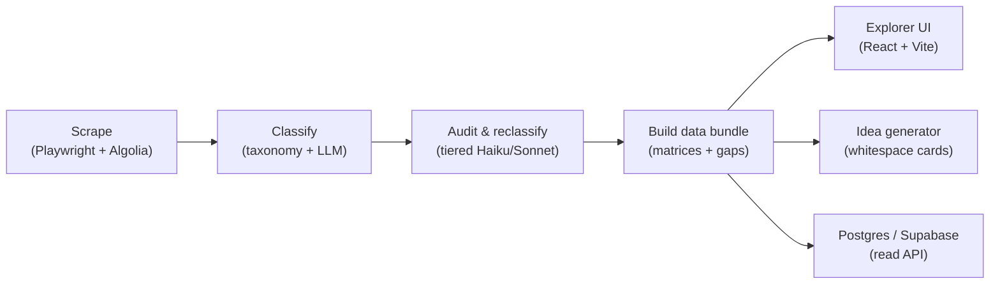

# Recombinator

[](https://www.recombinator.app)
[](https://github.com/rfdouglas97/recombinator/actions/workflows/ci.yml)
[](LICENSE)
[](https://nodejs.org)

Recombinator scrapes the [Y Combinator startup directory](https://www.ycombinator.com/companies), classifies every company into a structured **business-model × industry-vertical × phenotype** taxonomy (with an LLM audit pass), and surfaces **market whitespace** through an interactive explorer and a startup-idea generator.

**Live app: [recombinator.app](https://www.recombinator.app)**

Current corpus: **1,029 companies** across nine 2025–2027 batches (Winter 2025 → Winter 2027).

## Pipeline at a glance



| Stage                | Entry point                                             | Output                                          |
| -------------------- | ------------------------------------------------------- | ----------------------------------------------- |
| Scrape               | `npm run scrape`                                        | `output/yc_companies.json`                      |
| Classify             | `npm run classify`                                      | `output/yc_companies_classified.json`           |
| Phenotype + vertical | `npm run phenotype-agent`, `npm run verticals:classify` | `output/phenotypes/`, `output/verticals/`       |
| Audit + reclassify   | `npm run audit:tiered`, `npm run audit:reclassify`      | `output/audit/`                                 |
| Whitespace + ideas   | `npm run whitespace:rank`, `npm run startup-library`    | `output/whitespace/`, `output/startup-library/` |
| Explorer             | `npm run explorer:dev`                                  | `explorer/` (Vite)                              |
| Database / API       | `npm run db:migrate`, `npm run api:dev`                 | Postgres (see [`db/README.md`](db/README.md))   |

> **Why are JSON files in `output/` committed?** They are the pipeline's source-of-truth snapshots: the explorer build, the read API, and the daily GitHub Action all hydrate from them (the Action refreshes Supabase from the committed JSON on `main`). Treat them as generated data, not hand-edited files — `.prettierignore` and lint configs skip them accordingly.

## Development

```bash
npm install          # install backend tooling
npm test             # node:test unit + bundle-shape tests
npm run lint         # eslint (backend .mjs + explorer TS)
npm run format       # prettier --write
```

CI ([`.github/workflows/ci.yml`](.github/workflows/ci.yml)) runs formatting, lint, tests, and the explorer typecheck/build on every push and PR to `main`.

Where the project is headed: [`docs/ROADMAP.md`](docs/ROADMAP.md).

## What it collects

**From the directory listing (Algolia, via Playwright):** name, slug, website, one-liner, long description, batch, industry/subindustry, tags, team size, location, regions, stage, status, hiring flag, logo.

**From each company page (`data-page` JSON):** full descriptions, social links (LinkedIn, Twitter, GitHub, etc.), YC partner, photos, videos, and **founder profiles** (name, title, bio, LinkedIn, Twitter, avatar).

Output is written to `output/yc_companies.json` and `output/yc_companies.csv`.

## Setup

```bash
npm install
export PLAYWRIGHT_BROWSERS_PATH="$(pwd)/.playwright-browsers"
npx playwright install chromium
```

## Usage

Scrape all companies in the filtered batches (full run, ~1,029 companies):

```bash
npm run scrape
```

Quick test (first 10 companies):

```bash
npm run scrape:test
```

Listing only (no founder detail pages):

```bash
node scrape.mjs --list-only
```

Options:

| Flag                | Description                             |
| ------------------- | --------------------------------------- |
| `--url <url>`       | Custom directory URL with query filters |
| `--out <dir>`       | Output directory (default: `./output`)  |
| `--limit <n>`       | Cap number of companies                 |
| `--concurrency <n>` | Parallel detail fetches (default: 5)    |
| `--headed`          | Show browser window                     |
| `--list-only`       | Skip per-company pages                  |

## Taxonomy classification

Build structured records with YC descriptions, website links, and draft business-model labels:

```bash
npm run classify          # all companies → output/yc_companies_classified.json
npm run classify:pilot    # 20-company sample for review
npm run classify:pending  # descriptions + links only; taxonomy left empty for agent pass
```

Each classified record includes:

- **website** — company URL from YC
- **yc_profile_url** — YC company page
- **description** — `one_liner`, `long_description`, and `combined` (as YC provides)
- **taxonomy** — sector, business model (BM-01…BM-12), AI role, delivery, buyer, confidence, rationale

Taxonomy definitions: `taxonomy/v0.1.json`. Heuristic rules (pilot only): `taxonomy/classify-rules.mjs`.

## Phenotype discovery agent

Maps each startup to a **business phenotype** (agent harness, training data, vertical workflow agent, domain ontology, etc.) and an **industry sub-vertical** — then builds a sparse **phenotype × industry matrix** showing where startups cluster and where gaps exist.

```bash
# Anthropic (reads .env: ANTHROPIC_API_KEY or anthropic_api_key)
npm run phenotype-agent:test   # 3 companies
npm run phenotype-agent        # full run, --fresh resets prior assignments

# Resume after interrupt
npm run phenotype-agent:resume

# Optional: ANTHROPIC_MODEL=claude-haiku-4-5-20251001 for lower cost
# Parallelism (default 8): --concurrency 12 or PHENOTYPE_CONCURRENCY=12

# No API — local pattern matcher
npm run phenotype-agent:local
```

Outputs in `output/phenotypes/`:

| File               | Contents                                              |
| ------------------ | ----------------------------------------------------- |
| `assignments.json` | Per-company phenotype, AI play, descriptions, links   |
| `matrix.json`      | Sparse matrix + totals + empty archetype rows         |
| `ontology.json`    | Evolving phenotype library (seed + agent discoveries) |
| `patterns.json`    | Cross-cutting patterns from reflection passes         |
| `state.json`       | Checkpoint / resume state                             |

Seed phenotypes: `taxonomy/phenotype-seeds.json`.

## Classification QA (LLM audit + fix)

Every company in `output/phenotypes/assignments.jsonl` can be audited for phenotype, vertical, and business-model accuracy, then re-tagged.

**Pipeline (recommended order):**

```bash
# 1) Fast rule pass — fixes perps/marketplace vs fintech-insurance mis-tags (no API)
npm run audit:refine

# 2) Tiered LLM audit (~$15–20 for the full corpus): Haiku screens all, Sonnet only when uncertain
npm run audit:tiered
# Review: output/audit/review.html and review.csv

# 3) Re-tag companies flagged wrong/minor_fix
npm run audit:reclassify

# 4) Human queue + HTML review after fixes
npm run audit:human-queue && npm run audit:review
```

**Tiered audit** (`agent/tiered-audit.mjs`): every company gets a cheap Haiku pass with `classification_confidence`. Sonnet runs only when confidence is low, verdict is `wrong`, fintech phenotype is shaky, or vertical came from a YC fallback. Typical escalation ~15–25% → much cheaper than all-Sonnet.

```bash
TIERED_TIER1_MODEL=claude-haiku-4-5-20251001
TIERED_TIER2_MODEL=claude-sonnet-4-5-20250929
TIERED_ESCALATE_BELOW=0.85
TIERED_AUDIT_CONCURRENCY=12
```

**Model overrides** (single-model audit / reclassify):

```bash
CLASSIFICATION_AUDIT_MODEL=claude-haiku-4-5-20251001
CLASSIFICATION_RECLASSIFY_MODEL=claude-sonnet-4-5-20250929
CLASSIFICATION_AUDIT_CONCURRENCY=8
```

**Outputs:** `output/audit/classification-audits.json`, `reclassify-fixes.json`, `human-correction-queue.json`.

Rule-based archetype refinement (`taxonomy/infer-archetype.mjs`) catches cases like perps exchanges tagged as `fintech-insurance-ai-product` when copy has no AI wedge.

## Database Explorer UI

Interactive explorer for ontology trees and gap matrices (`explorer/`).

```bash
# Rebuild data bundle from pipeline outputs, then start dev server
npm run explorer:dev

# Production static build → explorer/dist/
npm run explorer:build
npm run explorer:preview   # from explorer/
```

**Views:**

- **Gap matrix** — BM × vertical (sector-collapsed or full vertical columns) and phenotype × industry; density vs whitespace overlays; click cells for company lists or gap opportunities
- **Ontology** — zoomable sunburst or icicle over industry vertical tree (sector → industry → vertical → companies) or phenotype tree (family → phenotype → companies)

**Filters:** batch, sector, industry, phenotype family, business model, confidence, search. URL params: `?view=ontology&sector=healthcare-life-sciences&matrix=bm_vertical`

Rebuild bundle after data changes: `npm run data:bundle`

## Notes

- The directory is client-rendered; the scraper scrolls to load all results and reads the Algolia API responses the page makes.
- Founder data lives on individual company pages, so a full scrape visits each `/companies/<slug>` URL.
- Respect YC’s terms of service and rate limits; default concurrency is 5.
- Heuristic classifications are drafts for review — replace with agent labels after you approve the taxonomy.
